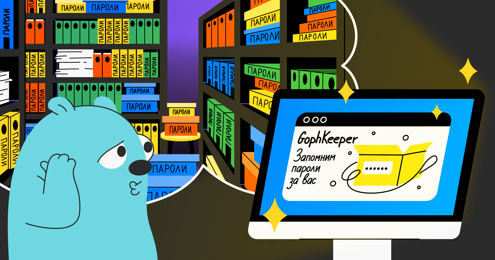

# Менеджер паролей GophKeeper

## Описание работы

### Общие требования

GophKeeper представляет собой клиент-серверную систему,
позволяющую пользователю надёжно и безопасно хранить логины,
пароли, бинарные данные и прочую приватную информацию.



### Серверная часть

На сервере все записи хранятся в одной таблице:

```postgresql
CREATE TABLE entries
(
    id         uuid UNIQUE NOT NULL DEFAULT gen_random_uuid(),
    public_key bytea       NOT NULL,
    payload    bytea       NOT NULL
);
```

- ID используем для обращения к конкретной записи в базе данных;
- PublicKey храним, чтобы пользователь мог получить все свои записи,
  а также удалить их;
- Payload - сами данные, зашифрованные ассиметричным алгоритмом RSA.

Получив доступ к базе данных, злоумышленник даже не сможет узнать,
какого типа данные хранит пользователь.

### Клиентская часть

Клиент представляет собой консольное приложение, которое дает пользователю
возможность сохранять и просматривать свои данные.

При запуске приложения пользователю будет предложено сгенерировать ключ,
либо загрузить уже имеющийся.

Приватный ключ хранится в файле в PEM-формате.

Локальная копия всех пользовательских данных хранится в sqlite базе данных,
синхронизируется во время запуска и при работе приложения.

### Соединяем сервер и клиент

Серверная и клиентская части приложения общаются между собой
по протоколу GRPC следующими методами:

#### Получить запись

Чтобы получить конкретную запись, пользователю достаточно знать ID.

Здесь нет никакой аутентификации, потому что данные без
приватного ключа все равно расшифровать не получится.

```protobuf
//rpc Get(GetRequest) returns (GetResponse);

message GetRequest {
  string id = 1;
}

message GetResponse {
  bytes data = 1;
}
```

#### Получить все записи

Получаем записи пользователя по его публичному ключу.

```protobuf
//rpc GetAll(GetAllRequest) returns (GetAllResponse);

message GetAllRequest {
  bytes public_key = 1;
}

message GetAllResponse {
  message Entry {
    string id = 1;
    bytes data = 2;
  }
  repeated Entry entries = 1;
}
```

#### Создать новую запись

Сохраняем зашифрованные данные пользователя и возвращаем ID.

Подписать нужно хеш данных, которые сохраняем ```SHA256(data)```.

```protobuf
//rpc Create(CreateRequest) returns (CreateResponse);

message CreateRequest {
  bytes public_key = 1;
  bytes data = 2;
  bytes sign = 3;
}

message CreateResponse {
  string id = 1;
}
```

#### Удалить запись

Удаляем пользовательские данные.

Подписать нужно дважды хешированные данные ```SHA256(SHA256(data))```,
чтобы даже в случае перехвата сообщения создания записи,
злоумышленник не мог ее удалить.

```protobuf
//rpc Delete(DeleteRequest) returns (google.protobuf.Empty);

message DeleteRequest {
  string id = 1;
  bytes sign = 2;
}
```

### Аутентификация

Аутентификацию производим с помощью RSASSA-PKCS1-V1_5-SIGN подписи SHA256 хеша данных:

```go
data := []byte("hello, world!")

// encrypt data
ciphertext, err := rsa.EncryptPKCS1v15(rand.Reader, publicKey, data)

// generate signature
hash := sha256.Sum256(ciphertext)
signature, err := rsa.SignPKCS1v15(rand.Reader, privateKey, crypto.SHA256, hash[:])

// verify signature
err = rsa.VerifyPKCS1v15(publicKey, crypto.SHA256, hash[:], signature)
```
